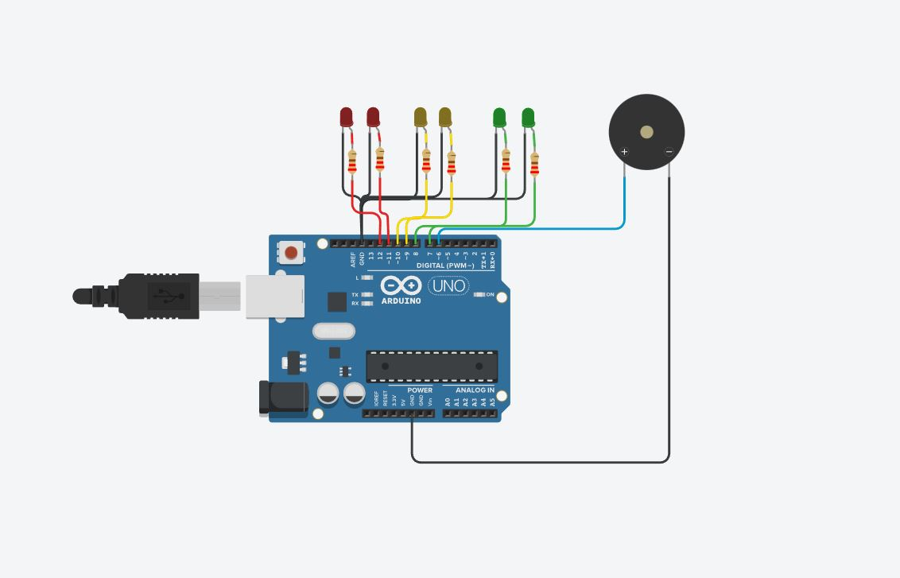

# Ejemplo Documentación Dojos

## Integrantes 
- Nicolas Dekker
- Ivo Curto
- Tobias Esquivel
- Jorge Cabezas
- Silvina Gauto
- Alvaro Braddy Calla Huangal

## Proyecto: Dojo Uno Semaforo.

## Descripción
Este programa controla un semáforo con dos luces de cada color (rojo, amarillo y verde) y un sonido para personas no videntes mientras la luz roja está encendida. 

Al principio se definen las constantes para los pines de los LEDs y el piezo. Tambien se establecen las variables para la duración de cada color del semáforo y para la frecuencia y duración del tono del piezo.

En la función "setup" se configuran los pines como entradas o salidas. En la función "loop" se maneja el patrón del semáforo y del pitido para no videntes. Primero se encienden los LEDs verdes por 5 segundos, luego los amarillos por 3 segundos y al final los LEDs rojos por 5 segundos con el sonido del piezo emitiendo dos pitidos por segundo.

Las funciones "encenderLed" y "apagarLed" sirven para encender y apagar los LEDs y son llamadas en la función "loop". La función "tone" sirve para generar un tono en el piezo y la función "noTone" para frenarlo.

## Función principal
Estas funciones son las que se encargan de encender y apagar los leds.

LEDROJAUNO , LEDROJADOS , LEDAMARILLAUNO , LEDAMARILLADOS , LEDVERDEUNO LEDVERDEDOS son #define que utilizamos para agregar los leds, asociandolo a pines de la placa arduino.

~~~ C++ (lenguaje en el que esta escrito)
void encenderLed(int ledUno, int ledDos, int tiempoEncendido)
{
  digitalWrite(ledUno, HIGH);
  digitalWrite(ledDos, HIGH);
  delay(tiempoEncendido);
}

void apagarLed(int ledUno, int ledDos)
{
  digitalWrite(ledUno, LOW);
  digitalWrite(ledDos, LOW);
}
~~~

## :robot: Link al proyecto
- [proyecto](https://www.tinkercad.com/things/kzoojtExKJF-ivo-curto-eivers-1b-dojo-a-primer-nivel/editel?sharecode=blM_sfte4mjfYAFwQZhj_rx6VgSKrYop5ZFPB5AzXtE)
## :tv: Link al video del proceso
- [video](https://youtu.be/w5THHZ0qJrs)

---
### Fuentes

- [Tutorial](https://www.youtube.com/watch?v=ATlVH0Gdxtg).

---
